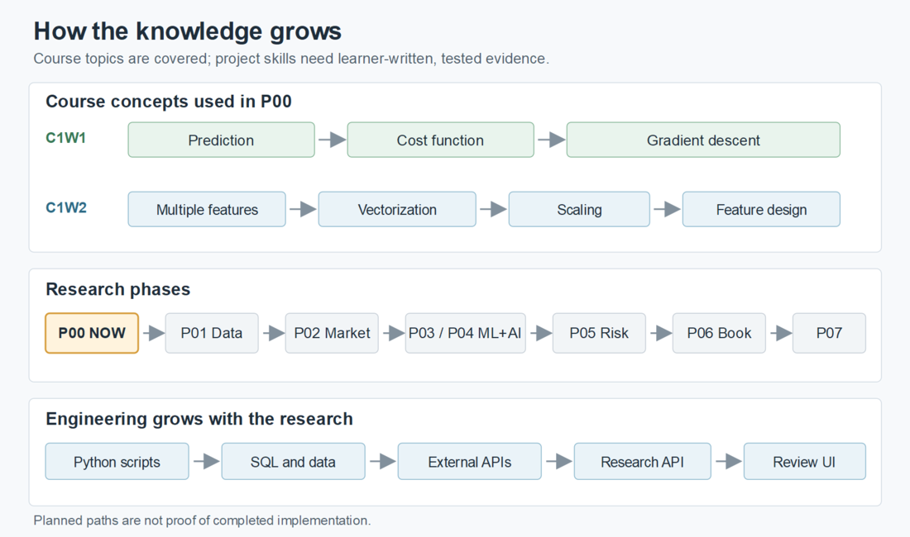

# Knowledge graph

## Purpose

This is the map from course knowledge to code, research outputs, and proof. The graph is complete for the **planned project structure**; a future concept has a planned node until the learner studies or demonstrates it. The graph does not claim that a linked topic is mastered.

Open [Knowledge/INDEX.md](Knowledge/INDEX.md) for the current concept nodes. Open [PROGRESS.md](PROGRESS.md) for task, phase, and overall completion. Open [JOURNEY.md](JOURNEY.md) for the chronological record.

## Relationship types

| Edge | Meaning |
|---|---|
| `requires` | The first node needs the second idea or artifact. |
| `practised_in` | A concept is used in a learner task. |
| `produces` | A task or phase creates an output. |
| `evidenced_by` | A claim is supported by an observed run, explanation, or review. |
| `extends_to` | A current capability becomes a later research capability. |

## Visual overview

The image is a simplified learning order, rendered as a PNG so it displays without Mermaid support. The tables below preserve the exact task and phase relationships. Course coverage is learner-reported; every current task remains at 0% until its checks pass.

## Current concept chain

| Course concept | Practised in |
|---|---|
| C1W1 linear regression | T01 prediction and later P00 tasks |
| C1W1 cost function | T02 and later P00 tasks |
| C1W1 gradient descent | T03 and later P00 tasks |
| C1W2 multiple features and vectorization | T01, then later P00 tasks |
| C1W2 feature scaling | T04 and later P00 tasks |
| C1W2 feature engineering | T05 and T06 |
| Integrated valuation-stretch interpretation | T06, after T01-T05 checks |

## Research chain

| Starting node | Edge | Destination | Current state |
|---|---|---|---|
| [C1W1-C1W2 concept set](Knowledge/INDEX.md) | `practised_in` | [P00 goal](Goals/ML-G01%20-%20C1W2%20Valuation%20Stretch%20Foundation/GOAL.md) | ready, no implementation evidence |
| [Project structure](Knowledge/K009_Project_Structure.md) | `practised_in` | [P00 scripts and checks](PHASE_00_C1W2_PLAN.md) | planned, no structure explanation observed |
| [Engineering path](ENGINEERING_LEARNING_PATH.md) | `extends_to` | [P01 SQL and P07 analyst workbench](ROADMAP.md) | planned, no full-stack evidence |
| [P00 goal](Goals/ML-G01%20-%20C1W2%20Valuation%20Stretch%20Foundation/GOAL.md) | `produces` | [valuation-stretch research output](RESEARCH_OUTPUTS.md) | planned |
| [Valuation stretch](Knowledge/K008_Valuation_Stretch.md) | `extends_to` | [expectations gap and bubble dimensions](BUBBLE_MONITOR.md) | planned |
| [Finance model](FINANCE_RESEARCH_MODEL.md) | `requires` | [point-in-time data](DATA_AND_LIVE_SYSTEM.md) | planned |
| [Point-in-time data](DATA_AND_LIVE_SYSTEM.md) | `produces` | [versioned research signals](SIGNAL_RESEARCH_PROGRAM.md) | planned |
| [AI evidence](TYPESAFE_AND_AI.md) | `extends_to` | [narrative-evidence gap](BUBBLE_MONITOR.md) | planned |
| [Signal research](SIGNAL_RESEARCH_PROGRAM.md) | `produces` | [paper portfolio and attribution](RESEARCH_OUTPUTS.md) | planned |
| [Research outputs](RESEARCH_OUTPUTS.md) | `evidenced_by` | [journey and evidence records](JOURNEY.md) | planned |

## Phase graph

| Phase | Needed before it starts |
|---|---|
| P01 point-in-time finance data | P00 first-principles model |
| P02 market and econometrics | P01 data foundation |
| P03 supervised ML signals | P02 market research |
| P04 AI evidence and deep learning | P01 data foundation; may advance alongside P02-P03 |
| P05 bubble and fragility | P03 and P04 evidence |
| P06 portfolio and signal book | P05 research and a promoted signal |
| P07 live paper research and defense | P06 paper system and operational readiness |

The sequence and every planned task are defined in [ROADMAP.md](ROADMAP.md). A later-course concept can be taught early under [MENTOR_MODE.md](MENTOR_MODE.md); its course week remains unconfirmed until the learner says it is complete.

Software engineering grows through [folder roles](Knowledge/K009_Project_Structure.md), [the engineering path](ENGINEERING_LEARNING_PATH.md), and the phase tasks in [ROADMAP.md](ROADMAP.md): Python execution -> SQL and data contracts -> APIs -> analyst interface and system design. These are planned links until the learner writes, runs, and explains the relevant code.

The engineering order in the image is a learning path, not a claim that every layer must wait for the previous phase to finish. P00 keeps only the script and checks needed now; the later layers receive their own evidence gates.

## Update contract

When a concept, task, source, model, or output changes:

1. Update its canonical document and status.
2. Update incoming and outgoing graph links here and in [Knowledge/INDEX.md](Knowledge/INDEX.md) where relevant.
3. Link the observed evidence from [JOURNEY.md](JOURNEY.md) and update [PROGRESS.md](PROGRESS.md).
4. Check that every internal Markdown link resolves and each graph claim matches its linked record.
5. Commit those changes together under the workflow in [GIT_WORKFLOW.md](GIT_WORKFLOW.md).

A planned link is a design relationship. An `evidenced_by` link must point to an actual saved observation, not a promise.
