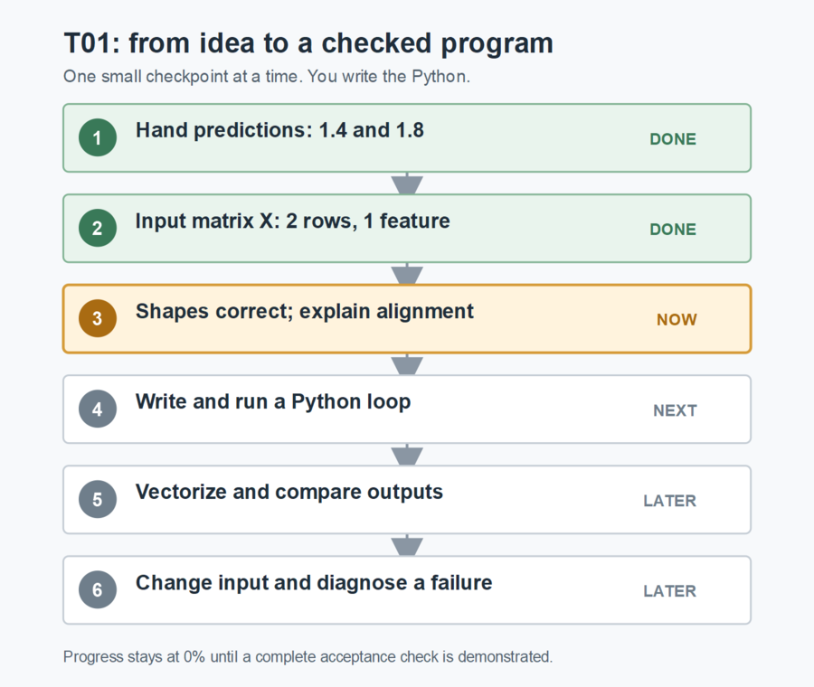

# Learning manual: AI Capital Cycle research engine

This is the one document to read and work from. It grows as you build the project. The current lesson is first; later lessons will be added here in the order you reach them. You write every assignment-code line. The mentor explains the idea, watches your runs, checks your reasoning, and keeps the checkpoint accurate.

## Where you are now

| Item | Current state |
|---|---|
| Course study | Machine Learning Specialization C1W1 and C1W2 completed, learner-reported; C1W3 not confirmed |
| Project | P00, first-principles valuation-stretch foundation |
| Active task | ML-G01-T01: prediction, first with one feature and two fictional companies |
| Correct so far | Hand predictions `1.4` and `1.8`; `X.shape == (2, 1)`, `w.shape == (1,)`, and prediction shape `(2,)` |
| Still to explain | Why the one feature in each row pairs with the one weight |
| Code | The learner's Python file is empty; no run has been observed |
| Evidence-backed progress | Task 0%, P00 0%, overall 0%; the first check is partial |



The picture is a rendered PNG, not a Mermaid code block. The table above gives the same state if an image viewer is unavailable.

## How the whole journey grows

| Stage | ML and finance | Python and engineering | Visible result |
|---|---|---|---|
| P00, now | Prediction, cost, gradient descent, multiple features, scaling, and a limited valuation-stretch signal | Values, arrays, loops, functions, `src`/`data`/`outputs`/`tests`, runs and checks | Predictions, cost curve, actual-versus-predicted plot, residual plot |
| P01 | Company fundamentals and information available at each date | File loading, SQL tables, keys, joins, and source records | Traceable company-quarter data |
| P02-P03 | Market behavior, event studies, and tested ML signals | Reusable modules, tests, repeatable model runs | Evaluation and failure reports |
| P04-P05 | AI evidence, expectations, and bubble fragility | External APIs, typed responses, versioned research records | Source-linked competing theses and fragility report |
| P06-P07 | Paper portfolio and live paper research | Read-only API, small analyst interface, reliability and system design | Evidence-linked research workflow and defended system |

These are future learning stages, not completed capabilities. We study the next layer when the current research problem needs it.

# Lesson 01: Predict before training

## 1. What you are building

You will make a small Python program that calculates a model output for each fictional company. First you will do the calculation with a loop. Then you will use NumPy to do the same calculation across rows. Both versions must agree. This prepares the inputs for the C1W1 cost function and gradient descent tasks that follow.

**Why now:** You already studied linear regression in C1W1 and vectorization in C1W2. The fastest way to make those ideas usable is to connect one hand calculation to arrays, Python execution, and a checked output. The five-feature version comes later in this same task.

**What you will get:** a learner-written, runnable prediction script and evidence that you understand the numbers and shapes. This is not a trained or investable model.

## 2. The concept and the finance meaning

For one feature, a linear model says:

```text
prediction = weight * feature + bias
```

The **feature** is an input, here revenue growth written as a decimal ratio. `0.20` means 20% growth, not 0.20%. The **weight** says how strongly that input changes the model output. The **bias** is the output when the feature is zero. These are mathematical roles; the trial weight and bias in this exercise were supplied, not learned from company data.

Later, the model output will stand for an estimated log valuation multiple. An observed value above the model's estimate will be called valuation stretch. A stretch is only a model difference; it does not by itself show mispricing, a bubble, or a future price move.

The first two companies are fictional:

| Company | Revenue growth | Trial weight | Trial bias | Your hand prediction |
|---|---:|---:|---:|---:|
| AstraCompute | 0.20 | 2.0 | 1.0 | 1.4, checked |
| NexaCloud | 0.40 | 2.0 | 1.0 | 1.8, checked |

The same weight and bias apply to both rows. You calculated both outputs correctly. The next question is how to represent this calculation for any number of rows without losing track of the dimensions.

## 3. Rows, features, weights, and shapes

A **shape** tells you how many entries an array has along each dimension. A table has rows and columns. Here one row is one company; one column is one feature. We call the table `X`. With two companies and one feature, your answer `X.shape == (2, 1)` is correct.

Use these rules to reason, not to memorize an answer:

- Each feature has a corresponding weight.
- Each company row produces one prediction.
- The bias is one number added to each row's weighted result.
- A one-dimensional NumPy array reports its shape with a trailing comma, such as `(3,)`; that is different from a three-row, one-column table `(3, 1)`.

Different example: suppose three companies each have **two** features. The input table has shape `(3, 2)`. There are two weights, so a one-dimensional weight array has shape `(2,)`. One output per company gives a prediction array of shape `(3,)`. The inner dimensions match: each two-feature row pairs with two weights.

**Your current check:** you answered `w.shape == (1,)` and prediction shape `(2,)` correctly. In your own words, explain why one feature column and one weight fit together. Then test the shapes in Python.

## 4. The Python ideas you will use

| Idea | Python form to recognize | Why it matters here |
|---|---|---|
| Import NumPy | `import numpy as np` | Gives you array operations. |
| Make an array | `np.array([...])` | Stores ordered numeric inputs or weights. |
| Inspect shape | `value.shape` | Checks the array you actually created. |
| Loop through values | `for item in values:` with an indented body | Makes each calculation visible before vectorizing. |
| Define a function | `def name(inputs):` and `return result` | Lets a calculation be rerun on changed input. |
| Dot product | `np.dot(matrix, weights)` | Multiplies each row's features by matching weights and sums them. |
| Compare numeric outputs | `np.allclose(first, second)` | Later checks loop and vectorized results within floating-point tolerance. |

These are building blocks, not a finished solution. You decide the variable names, array contents, functions, and control flow in the learner file. If a Python line is unfamiliar, we will explain that line on a different tiny example before you write it for this task.

## 5. Why the files are separated

| Folder | Job | Use in this task |
|---|---|---|
| `src/` | Source code, the instructions that calculate a result | Your first Python script lives here. |
| `data/` | Frozen inputs, later including dated source snapshots | The two-row fixture may stay in the script for now. |
| `outputs/` | Results such as saved plots and tables | No plot is due at this first shape check. |
| `tests/` | Checks that reveal wrong behavior | We begin with hand and changed-input checks. |

`src` is a common folder name, not a special Python command. Keeping code, inputs, outputs, and checks separate makes it possible to ask: which code and data produced this result, and did a test catch a mistake? We will add SQL, an API, and a browser interface only when those layers solve a real research problem. No database or server is needed today.

## 6. Your work, in order

| Step | What you do | Evidence | State |
|---|---|---|---|
| 1 | Calculate the two outputs by hand. | `1.4` and `1.8` | Done |
| 2 | Explain the input, weight, and output shapes. | Correct sizes and one sentence on matching dimensions | In progress; sizes correct, explanation pending |
| 3 | Write a Python loop for the two rows. | Run it and compare with the hand values | Not started |
| 4 | Write the vectorized NumPy form. | Show that both versions agree | Not started |
| 5 | Add a second feature, then the five-feature fixture. | Explain new shapes and compare both versions | Later |
| 6 | Change an input and intentionally create one bad shape. | Explain the changed output and the error | Later |

The first complete shape-and-hand check earns the first T01 progress credit. Correct arithmetic and `X` alone are saved as partial evidence, not full credit. The mentor will update this page after each meaningful checkpoint.

## 7. When you reach the editor

Open `D:\ML-project\Projects\AI Capital Cycle Quantamental Research Engine\src\01_vectorized_prediction.py`. It is empty on purpose. You write every assignment line. We will start with the smallest code that shows the inputs and one result; we will run it before adding another idea.

From PowerShell, after you have written the code, the file can be run from any directory with:

```powershell
python "D:\ML-project\Projects\AI Capital Cycle Quantamental Research Engine\src\01_vectorized_prediction.py"
```

Before each first run, say what you expect to see. After the run, compare the actual values and shapes. A mismatch is a useful observation to diagnose, not a reason to rush past the line.

## 8. Visual evidence still to come

Today's picture shows the task path, not model performance. When you reach gradient descent, you will plot cost against training steps to see whether learning is converging. Later you will plot actual against predicted values and the residuals, which are the differences between them. Each plot must come from your executed code and have an explanation of what it does and does not show.

## Next action

Write the smallest working version yourself in the empty Python file: create the two revenue-growth inputs, one trial weight, and bias; print the input and weight shapes; then use a loop to print one prediction per company. Predict the output before you run it. Show the run output and explain in one sentence why each one-feature row can pair with the one weight.

## How this manual is maintained

The mentor updates the current state and rendered picture only after observing your answer or run. New lessons are added here in sequence so this remains your one learning and doing document. Detailed task, evidence, and progress records still exist in the repository for audit, but you do not need to open them to do the current exercise. No course week or project task is marked complete merely because it appears here.
