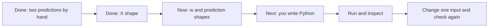

# Start here: learner desk

Updated: 2026-09-24. Open this page first when you return to the project. It tells you what to read and do **now**. The [task brief](Goals/ML-G01%20-%20C1W2%20Valuation%20Stretch%20Foundation/T01%20-%20Vectorized%20Prediction.md) owns the exercise; [PROGRESS.md](PROGRESS.md) owns completion; the [session note](Journey/2026-09-23-ML-G01-T01.md) records what actually happened.

## Read now

1. Read this page, especially **Current step** below.
2. Open [T01: Vectorized prediction](Goals/ML-G01%20-%20C1W2%20Valuation%20Stretch%20Foundation/T01%20-%20Vectorized%20Prediction.md). Read **Before you build**, the **first checkpoint** under Finance setup, and **Calibration before coding**. Leave the two- and five-feature fixtures for later.
3. Open [the learner Python file](Projects/AI%20Capital%20Cycle%20Quantamental%20Research%20Engine/src/01_vectorized_prediction.py) when we reach the coding step. It is intentionally empty so you write the implementation.

You do not need the full roadmap or another course-slide review for this small step. If the prediction idea is unclear, read [linear regression](Knowledge/K001_Linear_Regression.md); when vectorization begins, read [vectorization](Knowledge/K005_Vectorization.md). The [project map](HOME.md) and [engineering path](ENGINEERING_LEARNING_PATH.md) are there when their questions arise.

## Current step

| Item | State |
|---|---|
| Course coverage | C1W1 and C1W2 completed, learner-reported; C1W3 not confirmed |
| Active work | P00 / ML-G01-T01, one-feature prediction |
| Verified so far | Hand predictions `1.4` and `1.8`; `X.shape == (2, 1)` |
| Your next answer | Give the shapes of `w` and the prediction array, then explain why those sizes fit `X` |
| Code | No learner Python has been written or run yet |
| Progress | T01 0%, P00 0%, overall 0%; the first check is still open |

The [T01 session checkpoint](Journey/2026-09-23-ML-G01-T01.md) has the exact observed answers. A correct partial answer is saved, but it does not close a check that still has missing parts.

## Why these folders exist

| Folder | Plain-English job |
|---|---|
| `src/` | Your Python instructions for producing a result |
| `data/` | The inputs used by a run |
| `outputs/` | Results made by a run, such as plots and tables |
| `tests/` | Checks that catch wrong results or broken behavior |

For T01, only the script in `src/` is needed. Later we will use saved data, tests, and plots as the work grows. The [engineering path](ENGINEERING_LEARNING_PATH.md) explains when SQL, APIs, frontend code, and system design enter.

## What will become visual

The flowchart above shows the work sequence. The [knowledge graph](KNOWLEDGE_GRAPH.md) shows how concepts and phases connect. When the learner has written and run the model, P00 will add real plots: cost over training steps, actual versus predicted values, and valuation residuals. No model plot exists yet; a diagram of planned work is not evidence that the model ran.

## How this page stays current

After a meaningful checkpoint, the mentor checks the learner's actual answer or run, updates the [session note](Journey/2026-09-23-ML-G01-T01.md) and [progress ledger](PROGRESS.md), then refreshes this page's **Current step** and flowchart. [00_CURRENT_CONTEXT.md](00_CURRENT_CONTEXT.md) is refreshed last for future sessions. The public commit records the change. This page is the reading desk; the linked records remain the sources of truth.
